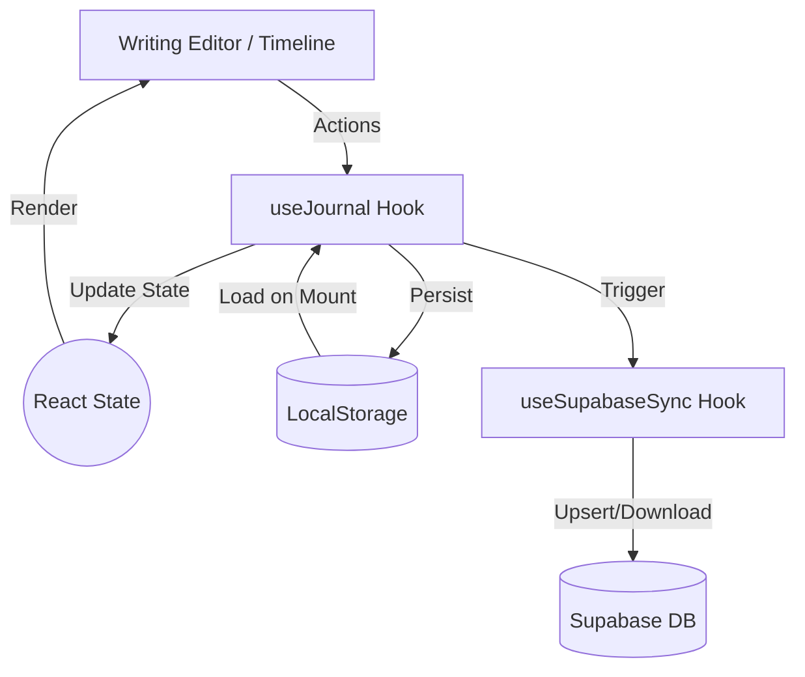

# Unwind Architecture Documentation

## Overview
Unwind is a minimalist, privacy-focused journaling application. It follows a "local-first" philosophy, ensuring that user data remains on their device by default, with optional cloud synchronization.

## Tech Stack
- **Framework**: Next.js 16 (App Router)
- **Language**: TypeScript
- **Styling**: Tailwind CSS 4.0
- **Animations**: Framer Motion
- **State Management**: React Hooks + LocalStorage
- **Database (Optional/Experimental)**: Supabase
- **PDF Generation**: jsPDF
- **Icons**: Lucide React
- **Testing**: Vitest (Unit), Playwright (E2E)

## System Architecture

### 1. Frontend Structure
The application is built as a Single Page Application (SPA) within the Next.js App Router.

- **`app/`**: Contains the main layout and page entry points.
- **`components/journal/`**: Core feature components.
  - `JournalApp`: The main container managing the application state (View switching, entry selection).
  - `WritingEditor`: Focused writing environment with prompts and mood selection.
  - `Timeline`: Chronological display of entries with search and filtering.
  - `DataManager`: Handles export/import and sync settings.
- **`hooks/`**: Custom hooks for business logic.
  - `useJournal`: Primary hook for CRUD operations, localStorage persistence, and quota management.
  - `useSupabaseSync`: Logic for optional cloud synchronization.

### 2. Data Flow
Unwind uses a tiered storage approach:

1.  **Memory State**: React `useState` in `useJournal` provides immediate UI updates.
2.  **Local Persistence**: `useEffect` in `useJournal` synchronizes memory state to `localStorage` (`unwind-journal-entries`).
3.  **Cloud Sync (Optional)**: If enabled, `useSupabaseSync` pushes changes to a Supabase PostgreSQL database.

### 3. Multi-Platform Sync Strategy
The sync strategy is designed to be simple yet robust for a single-user scenario:

- **Anonymous Auth**: Users are authenticated anonymously via Supabase to keep privacy high while allowing cross-device sync.
- **Upsert on Save**: Every save operation in the local app triggers an asynchronous upsert to Supabase if sync is enabled.
- **Pull on Load**: When the app starts with sync enabled, it fetches the latest entries from Supabase and merges them with local data, using the unique UUIDs to prevent duplicates.
- **Data Integrity**:
  - `local_created_at` and `local_updated_at` are tracked to ensure chronological consistency regardless of when the sync happened.
  - Validation occurs at every step (LocalStorage load, Import, Sync).

## Data Security & Privacy
- **No Tracking**: No analytics or telemetry.
- **Sanitization**: All imports and entries are sanitized to prevent XSS.
- **Quota Management**: Proactive monitoring of `localStorage` (5MB limit) with user warnings at 80% capacity.

## CI/CD Pipeline
The project uses GitHub Actions for Continuous Integration.
- **Trigger**: Every push and Pull Request to `main`.
- **Steps**:
  1. Linting (`eslint`)
  2. Unit Testing (`vitest`)
  3. E2E Testing (`playwright`)
  4. Production Build (`next build`)
- **Deployment**: Integrated with Vercel for Preview and Production deployments. Tests must pass before a PR is considered ready for merge.
